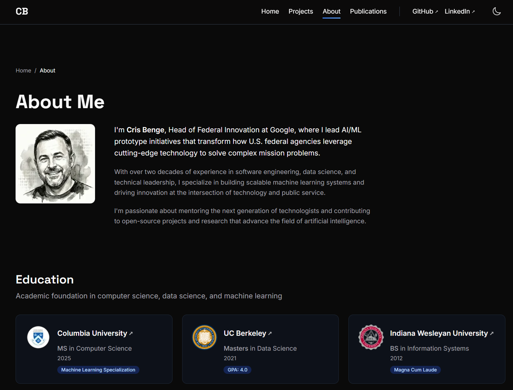

# cbenge509.github.io

**Personal portfolio for Cris Benge** — AI Researcher, builder, and technology leader.
This project contains a well-crafted static site built with Astro 5, Tailwind CSS v4, and TypeScript in strict mode built with GitHub.IO deployment in mind.

[](https://github.com/cbenge509/cbenge509.github.io/actions/workflows/deploy.yml)
[](https://github.com/cbenge509/cbenge509.github.io)
[](https://cbenge509.github.io)
[](https://cbenge509.github.io)
[](https://cbenge509.github.io)
[](https://cbenge509.github.io)
[](https://www.typescriptlang.org/)
[](https://astro.build)
[](https://opensource.org/licenses/MIT)

**[View Live Site →](https://cbenge509.github.io)**

<p align="center">
  
</p>

---

## About

This isn't just a portfolio — it's a reference implementation of modern static site architecture. Built with Astro 5's content collections, Tailwind CSS v4's new CSS-based configuration, and TypeScript in strict mode throughout. Every component is tested, every color meets WCAG AA contrast ratios, and the entire CI pipeline enforces quality gates before deployment.

## Features

| | Feature | Description |
|---|---------|-------------|
| 📚 | **Content Collections** | 6 Zod-validated collections: projects, publications, patents, education, certifications, awards |
| 🌓 | **Dark Mode** | System-aware with manual toggle, FOUC prevention via inline script |
| 📱 | **Responsive Design** | Mobile-first approach with fluid typography using `clamp()` |
| ♿ | **Accessible** | WCAG AA compliant, keyboard navigable, reduced motion support |
| 🧪 | **90%+ Coverage** | Unit tests with Vitest, E2E with Playwright across 3 browsers |
| 🚀 | **Lighthouse 100s** | Performance, Accessibility, Best Practices, SEO |
| 🔒 | **Security Scanning** | npm audit + Semgrep SAST in CI pipeline |
| 🔤 | **Self-Hosted Fonts** | Privacy-respecting, performance-optimized via @fontsource |

---

## Tech Stack

| Category | Technology | Why |
|----------|------------|-----|
| **Framework** | [Astro 5.x](https://astro.build) | Static generation, content collections, zero JS by default |
| **Styling** | [Tailwind CSS v4](https://tailwindcss.com) | CSS-native `@theme` config via `@tailwindcss/vite` |
| **Language** | [TypeScript](https://www.typescriptlang.org) | Strict mode, no `any` types allowed |
| **Unit Testing** | [Vitest](https://vitest.dev) | Co-located tests, AstroContainer API |
| **E2E Testing** | [Playwright](https://playwright.dev) | Chromium, Firefox, WebKit coverage |
| **Linting** | [gts](https://github.com/google/gts) | Google TypeScript Style for consistency |
| **CI/CD** | [GitHub Actions](https://github.com/features/actions) | Multi-stage pipeline with quality gates |
| **Hosting** | [GitHub Pages](https://pages.github.com) | Automated deployment on merge to master |

---

## Architecture

### Project Structure

```
src/
├── components/       # Astro components with co-located *.test.ts files
├── content/          # Content collections (Zod-validated schemas)
│   ├── projects/     # Portfolio projects (Markdown)
│   ├── publications/ # Academic papers (Markdown)
│   ├── patents/      # Patent filings (Markdown)
│   ├── education/    # Degrees (YAML)
│   ├── certifications/ # Professional certs (YAML)
│   └── awards/       # Competition wins (YAML)
├── layouts/          # BaseLayout with dark mode, SEO, analytics
├── styles/           # Tailwind v4 design system (@theme tokens)
├── utils/            # Utilities (cn.ts for class merging)
└── types/            # TypeScript type definitions
e2e/                  # Playwright E2E tests
test/fixtures/        # Mock data for unit tests
```

### Content Collections

| Collection | Type | Description |
|------------|------|-------------|
| `projects` | Content (MD) | Portfolio projects with categories: leader, builder, winner, research |
| `publications` | Content (MD) | Academic papers with authors, venue, abstract |
| `patents` | Content (MD) | Patent filings with status tracking |
| `education` | Data (YAML) | Degrees and institutions |
| `certifications` | Data (YAML) | Professional certifications by category |
| `awards` | Data (YAML) | Competition and professional awards |

### Design System

The design system lives in `src/styles/global.css` using Tailwind v4's CSS-native configuration:

```css
@theme {
  /* Semantic color tokens */
  --color-bg: #ffffff;
  --color-bg-dark: #0a0a0a;
  --color-accent: #2563eb;
  --color-accent-dark: #3b82f6;

  /* Typography */
  --font-display: 'Space Grotesk', system-ui, sans-serif;
  --font-sans: 'Inter', system-ui, sans-serif;
  --font-mono: 'JetBrains Mono', monospace;

  /* Transitions */
  --transition-fast: 150ms;
  --transition-medium: 300ms;
}
```

**Custom utilities:** `.focus-ring` for accessible focus states, `.text-display-lg` for responsive headlines, `.prose` for long-form content.

---

## Quality & Testing

### Testing Strategy

```
┌─────────────────────────────────────────────────────────────┐
│  Unit Tests (Vitest)          │  E2E Tests (Playwright)     │
├───────────────────────────────┼─────────────────────────────┤
│  • Co-located with components │  • Cross-browser coverage   │
│  • AstroContainer API         │  • Chromium, Firefox, WebKit│
│  • 90% coverage threshold     │  • Accessibility assertions │
│  • Fast, isolated             │  • Visual regression ready  │
└───────────────────────────────┴─────────────────────────────┘
```

**Component Testing Pattern:**
```typescript
import { experimental_AstroContainer as AstroContainer } from 'astro/container';

const container = await AstroContainer.create();
const result = await container.renderToString(Hero, {
  props: { title: 'Hello World' }
});
expect(result).toContain('Hello World');
```

### CI Pipeline

```
┌──────────────┐    ┌──────────────┐    ┌──────────────┐    ┌──────────────┐
│   Security   │    │    Lint &    │    │   Build &    │    │   E2E &      │
│  npm audit   │───▶│  Type Check  │───▶│  Unit Tests  │───▶│  Lighthouse  │───▶ Deploy
│   Semgrep    │    │     gts      │    │    Vitest    │    │  Playwright  │
└──────────────┘    └──────────────┘    └──────────────┘    └──────────────┘
```

### Code Quality Enforcement

- **TypeScript strict mode** — No `any` types, strict null checks
- **Google TypeScript Style** — Consistent formatting via gts
- **Pre-commit hooks** — Lint, format check, security scan before every commit
- **Branch protection** — All CI checks must pass before merge

---

## Performance & Accessibility

### Lighthouse Scores

| Performance | Accessibility | Best Practices | SEO |
|:-----------:|:-------------:|:--------------:|:---:|
| 💯 100 | 💯 100 | 💯 100 | 💯 100 |

### Accessibility Features

| Feature | Implementation |
|---------|----------------|
| **Color Contrast** | WCAG AA compliant — all ratios documented in design system |
| **Keyboard Navigation** | Visible `.focus-ring` on all interactive elements |
| **Touch Targets** | 44px minimum for buttons and links |
| **Reduced Motion** | `@media (prefers-reduced-motion)` disables all animations |
| **Semantic HTML** | Proper heading hierarchy, landmarks, ARIA where needed |
| **Dark Mode** | Respects `prefers-color-scheme`, with manual override |

### Performance Optimizations

| Optimization | Impact |
|--------------|--------|
| **Zero JS by default** | Only `ThemeToggle` component hydrates client-side |
| **Self-hosted fonts** | @fontsource eliminates third-party requests |
| **Static generation** | No server runtime, pure HTML/CSS/JS |
| **Image optimization** | Astro Image component with lazy loading |
| **Font subsetting** | Only required weights loaded |

---

## Local Development

```bash
# Clone the repository
git clone https://github.com/cbenge509/cbenge509.github.io.git
cd cbenge509.github.io

# Install dependencies
npm install

# Start development server (http://localhost:4321)
npm run dev

# Run unit tests
npm test

# Run E2E tests (all browsers)
npm run test:e2e

# Build for production
npm run build

# Preview production build
npm run preview
```

---

## License

MIT License — feel free to use this as inspiration for your own portfolio.

---

<p align="center">
  Built with <a href="https://astro.build">Astro</a> ·
  Styled with <a href="https://tailwindcss.com">Tailwind CSS</a> ·
  Deployed on <a href="https://pages.github.com">GitHub Pages</a>
</p>
