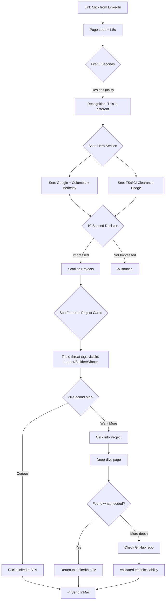
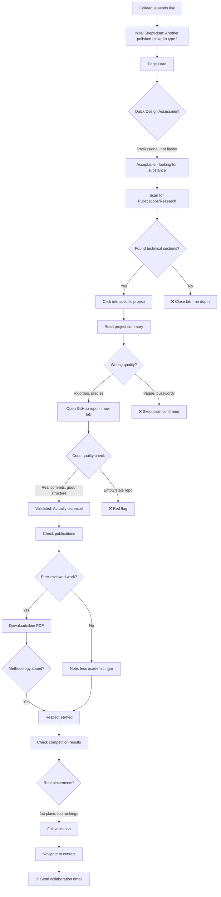
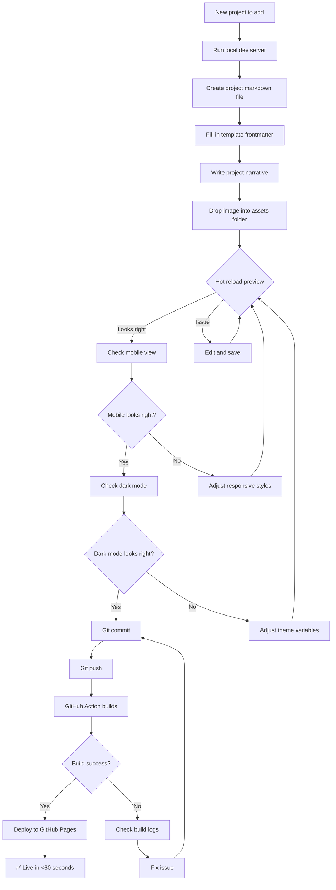

# UX Design Specification cbenge509.github.io

**Author:** Cris
**Date:** 2026-01-02

---

<!-- UX design content will be appended sequentially through collaborative workflow steps -->

## Executive Summary

### Project Vision

Transform Cris Benge's portfolio from a static information repository into an engaging, modern experience that actively sells visitors on professional excellence. The site must communicate competence and attention to detail through its very design - before visitors read a single word of content.

The core problem: current feedback is "good, but I didn't spend much time there." Visitors get bored or find the site unremarkable. For a Senior Director-level AI researcher targeting Meta, Anthropic, OpenAI, xAI, and Netflix, the portfolio must create instant "wow factor" that matches the caliber of the person behind it.

### Target Users

| Persona | Behavior | Success Moment |
|---------|----------|----------------|
| **Recruiter (Primary)** | Quick scan (30-60 seconds), looking for credibility signals, often on mobile | "This person pays attention to quality - I should reach out even for future roles" |
| **Peer/Collaborator (Secondary)** | Deeper exploration (5-10 min), evaluating technical depth and rigor | "This person is meticulous and high-caliber - I want to collaborate" |

### Key Design Challenges

1. **The 3-Second Test** - Recruiters decide in seconds. The design must communicate "elite professional" instantly, before any content is read.

2. **Dual Journey Tension** - Recruiters want quick credibility signals (role, credentials, clearance). Peers want depth (code, papers, methodology). The UX must serve both without overwhelming either.

3. **Information Density vs. Engagement** - 9 projects, publications, patents, certifications, awards, degrees. Showcase depth without creating walls of text that cause bounce.

4. **Dark Mode as First-Class Citizen** - A cohesive design system that feels intentional in both modes, not just inverted colors.

5. **Mobile Recruiter Reality** - Recruiters often view portfolios on phones between meetings. Touch targets, readability, and information hierarchy must work at 375px.

### Design Opportunities

1. **Hero Moment** - A strong visual opening that instantly positions Cris as "Google AI leader with Columbia/Berkeley credentials" - no scrolling required.

2. **Progressive Disclosure** - Let recruiters get what they need fast, but reward peers who go deeper with rich project pages, expandable sections, and linked resources.

3. **Credibility Through Craft** - Micro-interactions, thoughtful typography, consistent spacing, and attention to detail that signals "this person builds things properly."

4. **Technical Credibility as Social Proof** - Competition results (1st place DrivenData, Kaggle placements), GitHub repositories with real code, and shared research artifacts. Demonstrates "this person ships real work" - a powerful differentiator for a Senior Director who still codes.

5. **Call-to-Action Clarity** - Every page should have a clear next step (contact, LinkedIn, download CV) without being pushy.

## Core User Experience

### Defining Experience

The portfolio serves two distinct but complementary user journeys - and crucially, supports the conversion from one to the other:

| User | Core Action | Time Budget | Success State |
|------|-------------|-------------|---------------|
| **Recruiter (Rachel)** | Assess caliber, find contact path | 30-60 seconds | Impressed, clicks LinkedIn |
| **Peer (Marcus)** | Validate technical depth | 5-10 minutes | Convinced, reaches out to collaborate |
| **Rachel → Marcus** | Get hooked, go deep | Starts 30 sec, extends to 5+ min | Skeptic becomes advocate |

The site must communicate two equally important messages simultaneously: **"Senior Google AI leader"** AND **"Technical leader who still ships code."** These aren't competing narratives - together they form the unique value proposition that differentiates from other senior leaders who no longer code.

### Platform Strategy

| Platform | Priority | Context |
|----------|----------|---------|
| **Mobile Web** | PRIMARY | Recruiters between meetings - this is often the FIRST impression |
| **Desktop Web** | High | Peers doing deep technical research, extended exploration |
| **Hosting** | GitHub Pages | Static, fast CDN, no server dependencies |

**Design Approach:** Mobile-first, then ensure desktop is equally impressive. Not "mobile is acceptable" but "mobile is where we win or lose."

### Effortless Interactions

| Interaction | Must Be Effortless | Implementation |
|-------------|-------------------|----------------|
| **Find primary CTA** | Contextual: LinkedIn (recruiter), GitHub (peer on project), Scholar (peer on publication) | Small, fixed floating element - saves real estate while always accessible |
| **See credentials** | Above the fold, no scrolling | Hero section, instant visibility |
| **Access GitHub repos** | Repository cards with visible activity indicators | Prominent on project pages, teased on hero |
| **Read publications** | Clear path from any entry point | Expandable abstracts, linked PDFs, code repos |
| **Go deeper** | Every surface invites exploration | Cards tease, hero hints at depth, nothing feels like a dead end |

### Critical Success Moments

| Moment | User | What Must Happen |
|--------|------|------------------|
| **First 3 seconds** | Rachel | Instantly understands "Senior Google AI leader who still ships code" |
| **10-second mark** | Rachel | Floating CTA is obvious, LinkedIn reachable |
| **30-second mark** | Rachel → Marcus | Something hooks them - they start scrolling, clicking |
| **2-minute mark** | Marcus | Found GitHub repos, can see real code quality and activity |
| **5-minute mark** | Marcus | Reading publications, validating research rigor, thinking "I want to work with this person" |

### Experience Principles

**NORTH STAR:**

> **Dual Message, Single Glance** - The hero must communicate both "senior leader" AND "hands-on technical" simultaneously. This is the ONE thing that must work. Everything else supports this.

**Supporting Principles:**

1. **Mobile-First, Not Mobile-Acceptable** - Design for the recruiter on their phone between meetings. Desktop should be impressive, but mobile is where first impressions happen. Every element must work at 375px.

2. **Contextual CTAs, Always Within Reach** - The right next action is always obvious based on where the user is. Recruiter on hero → LinkedIn. Peer on project → GitHub. Reader on publication → Scholar/PDF. Implemented via small, fixed floating element that preserves screen real estate.

3. **Code as Credibility** - GitHub repositories with visible activity, real commits, quality code. Not buried in footers - prominent on project pages, teased on the hero. This is what transforms "claims to be technical" into "proof of technical."

4. **Always Reward Curiosity** - Every surface invites deeper exploration. Project cards tease enough to click. The hero hints at depth below. Publications feel like the tip of an iceberg. Nothing is a dead end. This enables the Rachel → Marcus conversion.

5. **Depth That Respects Time** - Recruiters get what they need above the fold. Peers who go deep find substance that justifies their investment - not walls of text, but expandable sections, linked resources, and evidence of rigor. Specifically: expandable project details, linked GitHub repos, downloadable papers, Google Scholar integration.

## Desired Emotional Response

### Primary Emotional Goals

| Emotion | Target User | Trigger |
|---------|-------------|---------|
| **Recognition of Rarity** | All visitors | The "triple threat" (leadership + technical + academic) is visibly uncommon - not just impressive, but statistically rare |
| **Confident** | All visitors | "This person knows what they're doing" - evident competence, not claimed competence |
| **Curiosity** | All visitors | Something at the 15-second mark that says "wait, there's more here" - pulls them deeper |
| **Urgency** | Recruiters | "I need to reach out before someone else does" - scarcity of this caliber candidate |
| **Respect** | Peers | Recognition of genuine rigor - code quality, publication methodology, competition results |

### The "Triple Threat" Differentiation

The emotional core of this portfolio is communicating that Cris operates at a fundamentally different level than the typical FAANG Senior Director:

1. **Leadership Experience** - Head of Federal Innovation at Google, team builder, strategic thinker
2. **Technical Hands-On** - Still writes code, ships projects, wins competitions
3. **Research & Academic** - Columbia MS, Berkeley MIDS, peer-reviewed publications, patents

Most senior leaders have ONE of these. Some have two. The combination of all three - and the portfolio proving it - creates the "recognition of rarity" that drives urgency.

**The 3-Second Signal:** The hero must communicate this triple threat instantly. This is the ONE thing that must work - everything else supports it.

### Emotional Journey Map

| Moment | Emotion | What Creates It |
|--------|---------|-----------------|
| **First 3 seconds** | Recognition of Rarity | Design quality + visible triple threat signal. "This isn't a typical portfolio." |
| **10-15 seconds** | Confident | Credentials visible - Google, Columbia, Berkeley, clearance. Claims backed by substance. |
| **15-30 seconds** | Curiosity | Something hooks them - a hint of depth, a surprising element. "Wait, there's more here." They scroll. |
| **1-2 minutes** | Urgent | The full picture emerges - technical leader who still ships. Recruiters think: "This combination is rare." |
| **5+ minutes** | Respect | Peers find real depth - GitHub repos with actual code, publications with methodology, competition wins. The rigor is genuine. |

### Micro-Emotions to Cultivate

| Positive State | How We Create It |
|----------------|------------------|
| **Trust** | Real artifacts (GitHub, publications, patents) - not just claims |
| **Curiosity** | Every surface invites deeper exploration; tease depth before revealing it |
| **Admiration** | The triple threat combination is genuinely impressive when seen together |
| **Connection** | Personal voice, evidence of passion (competitions done for love of craft) |

### Emotions to Actively Avoid

| Negative State | How We Prevent It |
|----------------|-------------------|
| **Corporate/Sterile** | Personal voice, evidence of passion, design with personality |
| **Overwhelmed** | Progressive disclosure, clean hierarchy, white space |
| **Skeptical** | Every claim has visible proof (link to repo, paper, result) |

### Emotional Design Principles

1. **Design as Proof** - The site's quality IS the first credential. Meticulous craft signals meticulous professional. Every pixel matters because every detail matters. **This requires zero-defect execution - any flaw contradicts the core message.**

2. **Recognition of Rarity, Not Just Impressiveness** - The goal isn't "wow, impressive." It's "wow, this combination is uncommon." The triple threat is the differentiator - make it visible instantly.

3. **Curiosity as the Bridge** - Credentials alone might make someone bookmark and leave. We need a hook at the 15-second mark that pulls them deeper. Tease the technical depth before revealing it.

4. **Show, Don't Tell** - Never claim "detail-oriented" - demonstrate it. Never claim "technical" - link to code. The portfolio is evidence, not assertion.

5. **Confident, Not Boastful** - Let achievements speak. Present facts cleanly. The triple threat is impressive on its own - it doesn't need superlatives.

6. **Passionate, Not Unprofessional** - Competition wins show love of craft. Side projects show curiosity. Academic work shows intellectual drive. Passion expressed through evidence, not exclamation points.

## UX Pattern Analysis & Inspiration

### Inspiring Products Analysis

Three primary inspiration sources inform the design direction:

#### Moritz Oesterlau Portfolio (moritzoesterlau.de)
| Element | Pattern | Application |
|---------|---------|-------------|
| Project Display | Minimal list, content-forward | Featured projects get breathing room |
| Navigation | Sticky header, hides on scroll | Present but unobtrusive |
| Color | Near-monochrome + single accent | Restraint signals sophistication |
| Interactions | Subtle gradient underline hovers | Delightful micro-interactions |
| Philosophy | "Restraint and clarity" | Confidence through simplicity |

#### Google Corporate Design
| Element | Pattern | Application |
|---------|---------|-------------|
| Typography | Clean hierarchy, systematic | Professional readability |
| Layout | Grid system, generous whitespace | Organized, scalable structure |
| Color | Functional, purposeful accents | Color has meaning |
| Interactions | Material Design micro-animations | Polished, tactile feedback |
| Philosophy | "Useful, fast, simple" | Technical excellence made accessible |

#### Apple Corporate Design
| Element | Pattern | Application |
|---------|---------|-------------|
| Typography | Type as hero element | Words become design |
| Imagery | Large, high-quality, intentional | Premium feel through craft |
| Whitespace | Aggressive negative space | Confidence in restraint |
| Animation | Smooth, scroll-triggered reveals | Discovery rewards engagement |
| Philosophy | "Detail = brand promise" | Every pixel proves quality |

### Transferable UX Patterns

#### Project Display: Hybrid Approach with Triple-Threat Mapping

**Featured Projects (3-4):** Large, Moritz-style presentation. Each featured project should prove one leg of the triple threat:

| Slot | Triple-Threat Leg | Project Criteria |
|------|-------------------|------------------|
| **Featured 1** | Leadership | Demonstrates strategic scope, team leadership, organizational impact (e.g., Google Federal Innovation) |
| **Featured 2** | Technical Builder | Shows hands-on code, deep technical work, real implementation (e.g., BERTVision) |
| **Featured 3** | Competitive Winner | Competition victories with rankings - proof of excellence under pressure (e.g., DrivenData 1st place) |
| **Featured 4** (optional) | Research/Academic | Publications, patents, peer-reviewed work (if distinct from above) |

This hierarchy means the featured section itself tells the story: **"Leader. Builder. Winner."**

**Secondary Projects (5-6):** Compact grid cards with thumbnails, scannable at a glance. Available for deeper exploration without dominating real estate.

#### Animation Strategy: Concentrated Wow

Rather than distributed animation throughout, focus investment on **one signature moment**:

| Animation Tier | Where | Approach | Purpose |
|----------------|-------|----------|---------|
| **Signature (Hero)** | Hero section entrance | Sequenced, polished, unforgettable | First impression "wow" - this is the moment |
| **Polish (Reveals)** | Scroll-triggered content | Subtle fade/slide-in via IntersectionObserver | Elegant content revelation, not delay |
| **Consistent (Hovers)** | All interactive elements | Gradient underlines, gentle lifts | Tactile feedback, proves attention to detail |

**Technical Constraints:**
- CSS animations over JavaScript where possible (GPU-accelerated)
- IntersectionObserver for scroll triggers (no scroll listeners)
- `prefers-reduced-motion` media query respected (accessibility)
- Within-page animations only - no between-page transitions (static site constraint)
- Dark mode animations specifically tested (color transitions can flash)
- Test on mid-tier mobile devices, not just high-end

#### Navigation Pattern
- Sticky header that hides on scroll-down, reveals on scroll-up
- Minimal items: key sections + contextual CTA
- Mobile: hamburger menu with smooth open/close animation

#### Hover & Focus States
- Gradient underline reveals on links (Moritz-inspired)
- Subtle scale/shadow lifts on project cards
- Smooth color transitions (150-200ms)

### Anti-Patterns to Avoid

| Anti-Pattern | Why It Fails | Our Alternative |
|--------------|--------------|-----------------|
| **Busy grid with equal-weight cards** | Everything competes, nothing stands out | Hybrid hierarchy with featured + secondary |
| **Animations for animation's sake** | Feels gimmicky, slows experience | Concentrated wow on hero, polish elsewhere |
| **Dark mode as afterthought** | Inverted colors look broken | Dark mode designed as first-class citizen |
| **Between-page transitions** | Complex on static sites, often janky | Within-page animations only |
| **Cluttered navigation** | Signals disorganization | Minimal nav, content does the talking |
| **Stock imagery or generic icons** | Undermines authenticity | Real project visuals, custom elements |
| **Slow page loads** | Contradicts "technical excellence" | Performance is a feature (<2s load) |

### Design Inspiration Strategy

#### ADOPT (Use Directly)
- **Moritz-style featured project presentation** - large, breathing, content-forward
- **Sticky header that hides on scroll** - present but unobtrusive
- **Gradient underline hover effects** - subtle delight
- **Aggressive whitespace** (Apple) - confidence through restraint
- **Triple-threat project mapping** - featured projects prove Leader/Builder/Winner

#### ADAPT (Modify for Context)
- **Apple scroll-triggered animations** - concentrate on hero, simplify elsewhere
- **Google systematic grid** - apply to secondary project cards only
- **Material Design interactions** - select specific patterns for hover states

#### EVALUATE (Test During Design)
- **Accent color only** - dark/light dual system is locked as architecture
- Test accent options against both light and dark backgrounds
- Decision made with visual mockups, not in abstract

#### AVOID (Explicitly Reject)
- Generic portfolio templates
- Animation libraries without customization
- Equal-weight project grids
- Between-page transitions on static site
- Decoration without purpose

## Design System Foundation

### Design System Choice

**Selected:** Tailwind CSS

**Decision Confidence:** High - all factors align

| Factor | Assessment |
|--------|------------|
| Prior Experience | ✅ User has Tailwind experience |
| Uniqueness Goal | ✅ Utility-first enables unique design |
| Dark Mode Requirement | ✅ Built-in `dark:` variant |
| Performance Target | ✅ PurgeCSS = minimal production CSS |
| Animation Strategy | ✅ Doesn't constrain custom animations |
| Static Site Compatibility | ✅ Works perfectly with GitHub Pages + SSG |

### Rationale for Selection

1. **Escapes Template Look** - Unlike component frameworks (Bootstrap, Material), Tailwind's utility-first approach means the design is entirely custom. No fighting against pre-built component styles.

2. **Dark Mode as Architecture** - The `dark:` variant makes dark mode a first-class citizen, not an afterthought. Styles like `bg-white dark:bg-gray-900` are declarative and maintainable.

3. **Performance by Default** - Production builds purge unused CSS, resulting in tiny stylesheets. Supports the <2s load time requirement.

4. **Animation Freedom** - Tailwind provides animation utilities but doesn't constrain custom CSS animations. The "concentrated wow" hero animation can be fully custom.

5. **Modern Signal** - Using Tailwind signals awareness of current best practices - part of "Design as Proof."

6. **Familiarity** - Prior Tailwind experience eliminates learning curve risk.

### Implementation Approach

#### SSG Recommendation: Evaluate Astro

**Primary Candidate:** Astro

| Benefit | Relevance |
|---------|-----------|
| Native Tailwind integration | Zero-config setup |
| Zero-JS by default | Performance for static portfolio |
| Component islands | Interactivity only where needed (theme toggle, nav) |
| Modern DX | Signals technical currency ("Design as Proof") |
| GitHub Pages compatible | Simple static build output |

Decision to be confirmed during technical spike, but Astro is the leading candidate.

#### Build Configuration
```
Tailwind CSS 3.x + Astro (evaluate)
├── PostCSS processing (built into Astro)
├── PurgeCSS for production (automatic)
├── Dark mode: 'class' strategy (manual toggle + system detection)
└── GitHub Pages deployment via GitHub Actions
```

#### Dark Mode Strategy

**FOUC Prevention (Critical):**

Inline script in `<head>` prevents flash of wrong theme:

```html
<head>
  <script>
    // Runs before body renders - no flash
    const theme = localStorage.getItem('theme') ??
      (window.matchMedia('(prefers-color-scheme: dark)').matches ? 'dark' : 'light');
    document.documentElement.classList.toggle('dark', theme === 'dark');
  </script>
</head>
```

**Tailwind Config:**
```javascript
// tailwind.config.js
module.exports = {
  darkMode: 'class', // Enables manual toggle + system detection
}
```

**Theme Toggle Behavior:**
- Check localStorage on load
- Fall back to `prefers-color-scheme`
- Toggle updates localStorage + class
- Smooth transition on toggle (but NOT on page load)

#### Typography Configuration

**Dual Font Strategy:**

| Context | Font | Rationale |
|---------|------|-----------|
| **Hero Headline** | Display font (TBD) | Personality, "wow" moment, recognition of rarity |
| **Body Text** | Inter | Clean, readable, professional |
| **Code/Monospace** | JetBrains Mono | Technical credibility |

Display font candidates to explore during design:
- **Clash Display** - Bold, modern, geometric
- **Cabinet Grotesk** - Distinctive, professional
- **Satoshi** - Clean but with personality
- **General Sans** - Balanced, versatile

Decision made with visual mockups.

**Typography Plugin with Dark Mode:**
```javascript
typography: {
  DEFAULT: {
    css: {
      color: '#374151',
      a: { color: 'var(--accent)' },
    }
  },
  dark: {
    css: {
      color: '#d1d5db',
      a: { color: 'var(--accent)' },
    }
  },
}
```

#### Animation Integration

Tailwind utilities for standard animations:
- `animate-fade-in`, `animate-slide-up` for scroll reveals
- `transition-*` utilities for hover states

Custom CSS for signature hero animation:
- Sequenced, multi-element entrance
- Intersection Observer for scroll triggers
- `prefers-reduced-motion` respected

### Customization Strategy

#### Design Tokens (tailwind.config.js)

```javascript
module.exports = {
  theme: {
    extend: {
      colors: {
        // Accent color via CSS custom property (runtime flexibility)
        accent: 'var(--accent)',
      },
      fontFamily: {
        display: ['Clash Display', 'sans-serif'], // TBD - evaluate options
        sans: ['Inter', 'system-ui', 'sans-serif'],
        mono: ['JetBrains Mono', 'monospace'],
      },
      spacing: {
        '18': '4.5rem',
        '22': '5.5rem',
        '26': '6.5rem',
        '30': '7.5rem',
        // Extended scale for Apple-style aggressive whitespace
      },
      animation: {
        'fade-in': 'fadeIn 0.5s ease-out',
        'slide-up': 'slideUp 0.6s ease-out',
        'hero-entrance': 'heroEntrance 1.2s ease-out',
      },
    },
  },
  plugins: [
    require('@tailwindcss/typography'),
  ],
}
```

#### CSS Custom Properties for Accent Color

Enables visual exploration and potential runtime theming:

```css
:root {
  --accent: #3b82f6; /* TBD - evaluate with mockups */
}
.dark {
  --accent: #60a5fa; /* Adjusted for dark backgrounds */
}
```

#### Component Patterns

Build custom components using Tailwind utilities:

| Component | Implementation Notes |
|-----------|---------------------|
| **Hero Section** | Display font, signature animation, custom layout |
| **Featured Project Card** | Large, Moritz-style, subtle hover with shadow lift |
| **Secondary Project Card** | Compact grid, gradient underline on hover |
| **Navigation** | Sticky header, hide-on-scroll (vanilla JS), minimal items |
| **CTA Buttons** | Accent color, gradient underline hover effect |
| **Dark Mode Toggle** | Custom icon, smooth transition |

**Gradient Underline Pattern (Moritz-inspired):**
```html
<a class="relative after:absolute after:bottom-0 after:left-0 after:h-0.5
          after:w-0 after:bg-accent after:transition-all hover:after:w-full">
  Link Text
</a>
```

#### Responsive Strategy

Mobile-first with Tailwind breakpoints:

| Breakpoint | Width | Target |
|------------|-------|--------|
| Default | < 640px | Mobile phones |
| `sm:` | 640px | Small tablets |
| `md:` | 768px | Tablets |
| `lg:` | 1024px | Desktop |
| `xl:` | 1280px | Large desktop |

Design mobile-first, enhance upward. Every component must work at 375px before scaling up.

## Defining Experience

### The Core Interaction

**Defining Experience:** "See the triple threat in 3 seconds, then explore to validate."

The hero section must communicate **Leader + Builder + Winner** before the visitor consciously processes it. Everything else - project pages, publications, GitHub links - exists to *validate* what they already sensed in that first moment.

This is the portfolio's "Tinder swipe" - the instant decision point that everything else supports.

### User Mental Model

| User | Arrives Expecting | Our Opportunity |
|------|-------------------|-----------------|
| **Rachel (Recruiter)** | "Portfolios are usually boring résumé extensions" | Exceed low expectations instantly → "Recognition of Rarity" |
| **Marcus (Peer)** | "Most senior leaders don't actually code anymore" | Prove technical credibility with visible artifacts → Respect |

Both user types expect mediocrity. Exceeding that expectation in 3 seconds is the defining moment.

### Success Criteria

| Test | Timeframe | Success | Failure |
|------|-----------|---------|---------|
| **Recognition** | 0-3 seconds | Visitor perceives "different level" before reading | Visitor sees "just another portfolio" |
| **Engagement** | 3-10 seconds | Visitor scrolls OR clicks CTA | Visitor bounces |
| **Curiosity** | 10-60 seconds | Visitor explores projects, reads content | Visitor got enough and leaves |
| **Action** | 1-5 minutes | LinkedIn click, email, bookmark, or share | Close tab without action |

**Quantifiable Signals (with analytics):**
- Scroll depth > 50% = curiosity working
- Time on site > 60 seconds = engagement successful
- CTA click = conversion
- Return visit = strong success

### Pattern Analysis

| Aspect | Pattern Type | Approach |
|--------|--------------|----------|
| **Hero layout** | Established | Clean hero with name, role, credentials - users know this pattern |
| **Triple-threat signal** | Novel twist | Communicate Leader + Builder + Winner simultaneously (most portfolios only do one) |
| **Progressive disclosure** | Established | Featured → Secondary → Detail pages |
| **Concentrated animation** | Novel execution | Hero entrance as signature "wow," not distributed everywhere |
| **Dark mode** | Established | Expected by modern users, executed as first-class citizen |

**The Innovation:** Not in *what* we show, but in *how densely and elegantly* we communicate value in the first 3 seconds. The triple-threat combination is rare; the design must make that rarity instantly visible.

### Experience Mechanics

#### Phase 1: Initiation (0-1 seconds)
- Page loads fast (<1.5s First Contentful Paint)
- No FOUC - dark mode resolved before body renders
- Hero signature animation begins immediately
- Visitor's eyes land on the hero section

#### Phase 2: The Hero Moment (1-3 seconds)

The hero must communicate simultaneously:

| Signal | Purpose | Implementation |
|--------|---------|----------------|
| **Name** | Identity anchor | "Cris Benge" - prominent, display font |
| **Current Role** | Leadership credibility | "Head of Federal Innovation, Google" |
| **Triple Threat Hint** | Differentiation | Visual or textual signal of Leader + Builder + Winner |
| **Credentials** | Validation | Columbia, Berkeley (subtle but visible) |
| **Design Quality** | Proof of craft | Typography, spacing, animation = "this person pays attention" |

**Critical Constraint:** All of this must register *before* the visitor consciously reads. The *gestalt* communicates first; details confirm second.

#### Phase 3: Curiosity Hook (3-10 seconds)
- Something below the fold invites scrolling
- Featured project cards tease depth
- The design quality itself rewards continued attention
- Visitor thinks: "Wait, there's more here"

#### Phase 4: Exploration (10-60+ seconds)
- Featured projects validate each leg of the triple threat
- Secondary project grid offers additional proof
- Publications, patents, competition wins reinforce credibility
- Every page has contextual CTA (LinkedIn, GitHub, Scholar)

#### Phase 5: Action (Conversion)

| User | Primary Action | Secondary Action |
|------|----------------|------------------|
| **Rachel (Recruiter)** | Click LinkedIn, send message | Bookmark, share with hiring manager |
| **Marcus (Peer)** | Deep-dive GitHub repos | Read publications, reach out for collaboration |

### The "3-Second Signal"

The hero must answer this question instantly:

> **"Why is this person different from other Senior Directors?"**

**Answer (communicated through design, not stated):**
- Senior Google leader (credibility)
- Who still writes code and wins competitions (rare)
- With academic research and publications (depth)
- And a portfolio that itself demonstrates excellence (proof)

The triple threat is the message. The design is the proof. The first 3 seconds are the test.

## Visual Design Foundation

### Color System

#### Primary Palette

| Role | Light Mode | Dark Mode | Usage |
|------|------------|-----------|-------|
| **Background** | `#ffffff` | `#0a0a0a` | Page background |
| **Surface** | `#f8fafc` | `#171717` | Cards, elevated elements |
| **Text Primary** | `#1a1a1a` | `#fafafa` | Headings, body text |
| **Text Secondary** | `#6b7280` | `#9ca3af` | Captions, metadata |
| **Accent** | `#2563eb` | `#3b82f6` | CTAs, links, highlights |

#### Accent Color Rationale

**Google Blue** selected for:
- Professional, trustworthy association
- Subtle tech/Google reference without being explicit
- Strong contrast in both light and dark modes
- Signals technical competence and reliability

#### Semantic Color Tokens

```css
:root {
  /* Base colors */
  --color-bg: #ffffff;
  --color-surface: #f8fafc;
  --color-text: #1a1a1a;
  --color-text-secondary: #6b7280;
  --color-accent: #2563eb;

  /* Semantic tokens (for flexibility) */
  --color-cta-bg: var(--color-accent);
  --color-cta-text: #ffffff;
  --color-link: var(--color-accent);
  --color-link-hover: #1d4ed8;

  /* State colors */
  --color-success: #16a34a;
  --color-warning: #d97706;
  --color-error: #dc2626;
}

.dark {
  --color-bg: #0a0a0a;
  --color-surface: #171717;
  --color-text: #fafafa;
  --color-text-secondary: #9ca3af;
  --color-accent: #3b82f6;

  --color-cta-bg: var(--color-accent);
  --color-link: var(--color-accent);
  --color-link-hover: #60a5fa;

  --color-success: #22c55e;
  --color-warning: #fbbf24;
  --color-error: #f87171;
}
```

### Typography System

#### Font Stack

| Role | Font | Weight | Usage |
|------|------|--------|-------|
| **Display** | Space Grotesk | 600-700 | Hero headline, tagline, section titles |
| **Body** | Inter | 400-600 | Body text, UI elements |
| **Mono** | JetBrains Mono | 400-500 | Code snippets, technical details |

#### Font Loading Strategy (FOUT Prevention)

```html
<!-- Preconnect for faster font loading -->
<link rel="preconnect" href="https://fonts.googleapis.com">
<link rel="preconnect" href="https://fonts.gstatic.com" crossorigin>

<!-- Font imports with display strategy -->
<link href="https://fonts.googleapis.com/css2?family=Space+Grotesk:wght@600;700&family=Inter:wght@400;500;600&display=swap" rel="stylesheet">
```

- **Space Grotesk**: `font-display: optional` - prevents layout shift on hero
- **Inter**: `font-display: swap` - shows fallback then swaps
- **JetBrains Mono**: Load conditionally only on pages with code snippets

#### Responsive Type Scale

| Level | Mobile | Tablet | Desktop | Line Height | Font |
|-------|--------|--------|---------|-------------|------|
| **Hero Name** | 2.5rem (40px) | 3rem (48px) | 3.5rem (56px) | 1.1 | Space Grotesk 700 |
| **Hero Tagline** | 1.125rem (18px) | 1.25rem (20px) | 1.375rem (22px) | 1.3 | Space Grotesk 600 |
| **H1** | 2rem (32px) | 2.25rem (36px) | 2.5rem (40px) | 1.2 | Space Grotesk 700 |
| **H2** | 1.5rem (24px) | 1.625rem (26px) | 1.75rem (28px) | 1.3 | Space Grotesk 600 |
| **H3** | 1.125rem (18px) | 1.1875rem (19px) | 1.25rem (20px) | 1.4 | Space Grotesk 600 |
| **Body Large** | 1rem (16px) | 1.0625rem (17px) | 1.125rem (18px) | 1.7 | Inter 400 |
| **Body** | 1rem (16px) | 1rem (16px) | 1rem (16px) | 1.7 | Inter 400 |
| **Small** | 0.875rem (14px) | 0.875rem (14px) | 0.875rem (14px) | 1.6 | Inter 400 |
| **Micro** | 0.75rem (12px) | 0.75rem (12px) | 0.75rem (12px) | 1.5 | Inter 500 |

#### Typography Rationale

**Space Grotesk** selected for display because:
- Technical, monospace-inspired character reinforces "this person codes"
- Distinctive without being decorative
- Strong presence at large sizes
- Used for BOTH hero name AND tagline ("Leader. Builder. Winner.") for visual unity
- Excellent contrast with Inter body text

### Spacing & Layout Foundation

#### Spacing Strategy: Generous (Apple-style)

Philosophy: **Confident restraint** - let elements breathe, signal premium quality through whitespace.

#### Spacing Scale

| Token | Value | Tailwind | Usage |
|-------|-------|----------|-------|
| `space-1` | 0.25rem (4px) | `1` | Micro gaps, icon padding |
| `space-2` | 0.5rem (8px) | `2` | Tight element spacing |
| `space-3` | 0.75rem (12px) | `3` | Related element groups |
| `space-4` | 1rem (16px) | `4` | Standard component padding |
| `space-6` | 1.5rem (24px) | `6` | Card padding, comfortable gaps |
| `space-8` | 2rem (32px) | `8` | Section content padding |
| `space-12` | 3rem (48px) | `12` | Between content blocks |
| `space-16` | 4rem (64px) | `16` | Between major sections |
| `space-20` | 5rem (80px) | `20` | Hero breathing room |
| `space-24` | 6rem (96px) | `24` | Major section dividers |

#### Custom Tailwind Spacing Tokens

```javascript
// tailwind.config.js
spacing: {
  'section': '6rem',    // 96px - Between major sections
  'block': '4rem',      // 64px - Between content blocks
  'element': '2rem',    // 32px - Within sections
  'hero-y': '4rem',     // Vertical hero padding (sized for project hint)
}
```

#### Layout Principles

1. **Hero Section**: Sized to allow project section hint above the fold
   - Generous but not viewport-filling
   - Centered content with comfortable padding
   - "Featured Projects" title visible without scrolling on most screens

2. **Project Hint Above Fold**: Hero height calculated so that on a typical 768px viewport height, at least the "Featured Projects" heading is visible, inviting the scroll.

3. **Section Gaps**: 4-6rem between major sections - aggressive whitespace signals confidence

4. **Card Padding**: 1.5-2rem internal padding - content doesn't feel cramped

5. **Line Height**: 1.6-1.7 for body text - readable, airy, professional

6. **Max Content Width**:
   - Prose: 65-70ch for optimal readability
   - Full width: 1280px max with generous side padding

#### Grid System

| Breakpoint | Columns | Gutter | Margin |
|------------|---------|--------|--------|
| Mobile (<640px) | 4 | 1rem | 1.5rem |
| Tablet (640-1024px) | 8 | 1.5rem | 2rem |
| Desktop (>1024px) | 12 | 2rem | auto (centered) |

### Accessibility Considerations

#### Color Contrast

All color combinations meet WCAG AA standards (4.5:1 for normal text, 3:1 for large text):

| Combination | Light Mode | Dark Mode | Ratio |
|-------------|------------|-----------|-------|
| Text on Background | `#1a1a1a` on `#ffffff` | `#fafafa` on `#0a0a0a` | >15:1 |
| Secondary Text | `#6b7280` on `#ffffff` | `#9ca3af` on `#0a0a0a` | >4.5:1 |
| Accent on Background | `#2563eb` on `#ffffff` | `#3b82f6` on `#0a0a0a` | >4.5:1 |

#### Typography Accessibility

- Minimum body text: 16px (1rem)
- Line height: 1.6+ for body text (exceeds 1.5 WCAG recommendation)
- Font weight: 400+ for body (no light weights)
- Responsive scaling ensures readability at all breakpoints

#### Motion Accessibility

- All animations respect `prefers-reduced-motion`
- No essential information conveyed only through animation
- Transitions kept under 300ms for reduced motion users

#### Focus States

- Visible focus rings on all interactive elements
- Focus ring: 2px accent color with 2px offset
- Keyboard navigation fully supported

## Design Direction

### Selected Direction: Hybrid Approach

**Primary Layout:** Left-Aligned Bold (Direction 2)
**Project Cards:** Card-Based Modern (Direction 4)

This hybrid combines the strongest elements of both directions to create a cohesive, distinctive design.

### Left-Aligned Bold Hero (From Direction 2)

| Element | Implementation | Rationale |
|---------|----------------|-----------|
| **Layout** | Asymmetric, content left-aligned | Creates dynamic tension, editorial presence |
| **Name Treatment** | Large, bold, left-anchored | Strong first impression, confident |
| **Role/Tagline** | Positioned below name, also left-aligned | Natural reading flow (L→R, top→bottom) |
| **Credentials** | Credential badges in horizontal row | Quick visual scan of qualifications |
| **CTAs** | Left-aligned button group | Clear action path, not centered/hesitant |
| **Visual Weight** | Heavy left, open right | Allows breathing room, not cluttered |

**Why Left-Aligned Bold:**
- Creates immediate visual hierarchy - the eye knows where to start
- Editorial feel signals "professional communication" not "template portfolio"
- Asymmetry creates visual interest without decoration
- Confident positioning matches "Recognition of Rarity" emotional goal
- Works beautifully on mobile (natural left-align)

### Card-Based Modern Projects (From Direction 4)

| Element | Implementation | Rationale |
|---------|----------------|-----------|
| **Featured Cards** | Large cards with image, title, description, tags | Rich preview invites click |
| **Card Structure** | Thumbnail area + content area + tag footer | Clear information hierarchy |
| **Hover State** | Subtle lift + shadow deepening | Tactile feedback, invites interaction |
| **Tags** | Category badges (Technical, Winner, Leadership) | Quick scanning, triple-threat mapping |
| **Grid Layout** | Responsive grid, 2-up on tablet, 1-up mobile | Maintains card prominence at all sizes |

**Why Card-Based Modern Projects:**
- Cards provide better visual containment than list-style
- Image thumbnails create visual interest and recognition
- Tag system supports triple-threat categorization
- More engaging for scroll-through browsing
- Natural click affordance (entire card is target)

### Hybrid Integration

```
┌─────────────────────────────────────────────────────────┐
│ HERO SECTION (Left-Aligned Bold)                        │
│                                                         │
│   Cris Benge                                            │
│   Head of Federal Innovation, Google                    │
│                                                         │
│   [Columbia MS] [Berkeley MIDS] [TS/SCI]               │
│                                                         │
│   [LinkedIn →]  [GitHub →]                              │
│                                                         │
├─────────────────────────────────────────────────────────┤
│ FEATURED PROJECTS (Card-Based Modern)                   │
│                                                         │
│   ┌─────────────────┐  ┌─────────────────┐             │
│   │  ┌───────────┐  │  │  ┌───────────┐  │             │
│   │  │   IMAGE   │  │  │  │   IMAGE   │  │             │
│   │  └───────────┘  │  │  └───────────┘  │             │
│   │  Title          │  │  Title          │             │
│   │  Description... │  │  Description... │             │
│   │  [Technical]    │  │  [Winner]       │             │
│   └─────────────────┘  └─────────────────┘             │
│                                                         │
└─────────────────────────────────────────────────────────┘
```

### Visual Continuity Elements

To ensure the hybrid feels cohesive:

| Element | Approach |
|---------|----------|
| **Color Accent** | Google Blue (#2563eb/#3b82f6) consistent throughout |
| **Typography** | Space Grotesk for all headings (hero AND card titles) |
| **Spacing** | Generous Apple-style spacing maintained in both sections |
| **Hover Effects** | Consistent gradient underline pattern on links |
| **Card Shadows** | Subtle shadows that increase on hover (same treatment) |
| **Border Radius** | Consistent 8-12px radius on cards and buttons |

### Responsive Behavior

| Breakpoint | Hero | Featured Projects |
|------------|------|-------------------|
| **Mobile (<640px)** | Full-width, stacked, left-aligned | Single column cards |
| **Tablet (640-1024px)** | Comfortable padding, same layout | 2-column card grid |
| **Desktop (>1024px)** | Max-width container, generous margins | 2-3 column card grid |

### Animation Integration

| Section | Animation | Timing |
|---------|-----------|--------|
| **Hero** | Signature entrance - name, role, credentials sequence | 0-1.2s on page load |
| **Project Cards** | Fade-up on scroll into view | IntersectionObserver triggered |
| **Card Hover** | Subtle lift (translateY -4px) + shadow deepen | 200ms ease-out |
| **Links** | Gradient underline reveal | 150ms ease |

### Design Direction Rationale Summary

This hybrid approach achieves:

1. **Confidence Without Arrogance** - Left-aligned hero is assertive but not centered/self-important
2. **Engagement Through Cards** - Card-based projects invite exploration more than lists
3. **Triple-Threat Visibility** - Tags on cards make Leader/Builder/Winner immediately scannable
4. **Mobile Excellence** - Both patterns work naturally on mobile
5. **Cohesive System** - Shared typography, color, and spacing create unity despite mixing directions

## User Journey Flows

### Rachel's Journey: Recruiter Quick-Scan Flow

**Entry Point:** LinkedIn referral → portfolio link click

**The 60-Second Decision Path:**



**Critical Success Points:**

| Moment | What Must Happen | Design Element |
|--------|------------------|----------------|
| **0-1s** | Page loads instantly | Optimized assets, preconnect |
| **1-3s** | Design quality registers | Left-aligned bold hero, Space Grotesk typography |
| **3-5s** | Credentials visible | Role, degrees, clearance badges above fold |
| **5-15s** | Something hooks | Featured project cards tease depth |
| **15-60s** | CTA obvious | LinkedIn button prominent in hero |

**Error Recovery:**
- If scroll depth is low → project hint visible above fold invites scrolling
- If CTA missed → floating nav appears on scroll with LinkedIn link

---

### Marcus's Journey: Peer Deep-Dive Flow

**Entry Point:** Colleague recommendation → direct link to project or site

**The 12-Minute Validation Path:**



**Critical Success Points:**

| Moment | What Must Happen | Design Element |
|--------|------------------|----------------|
| **0-30s** | Substance visible | Publications, project cards with GitHub indicators |
| **1-2m** | Project page validates | Technical writing, working GitHub links |
| **2-5m** | Code proves claims | Well-organized repos, real commits |
| **5-10m** | Research validates | PDF access, clear methodology |
| **10-12m** | Contact accessible | Email/LinkedIn in project footer and nav |

**Error Recovery:**
- If GitHub link broken → fallback to detailed technical writeup
- If publication PDF unavailable → link to Google Scholar profile
- If competition results unclear → display rankings prominently on cards

---

### Cris's Journey: Content Maintainer Flow

**Entry Point:** New project completed → want to add to portfolio

**The <30-Minute Update Path:**



**Critical Success Points:**

| Moment | Target Time | Design Element |
|--------|-------------|----------------|
| **Dev server start** | <10 seconds | Astro fast HMR |
| **Template creation** | <5 minutes | Clear markdown structure |
| **Content writing** | <15 minutes | Focused narrative template |
| **Preview cycle** | <2 minutes | Hot reload, no refresh needed |
| **Deploy complete** | <60 seconds | Optimized GitHub Action |

**Error Recovery:**
- Build fails → clear error messages in Actions log
- Image path wrong → linting catches before commit
- Missing frontmatter → schema validation warns

---

### Journey Patterns

Common patterns extracted across all journeys:

**Navigation Patterns:**

| Pattern | Implementation | Used In |
|---------|----------------|---------|
| **Progressive Disclosure** | Hero → Featured → Secondary → Detail | Rachel, Marcus |
| **Contextual CTA** | Right action based on current location | All journeys |
| **Breadcrumb Return** | Easy path back from detail pages | Marcus |
| **Floating Nav** | Appears on scroll with key links | Rachel |

**Decision Patterns:**

| Pattern | Implementation | Used In |
|---------|----------------|---------|
| **3-Second Signal** | Design quality + credentials visible instantly | Rachel |
| **Validation Layers** | Each click deepens proof of claims | Marcus |
| **Preview Before Commit** | Hot reload before deploy | Cris |

**Feedback Patterns:**

| Pattern | Implementation | Used In |
|---------|----------------|---------|
| **Hover Invitation** | Card lifts, underlines reveal | Rachel, Marcus |
| **Load Confirmation** | Fast initial render, no layout shift | All |
| **Success Signals** | Build complete notification | Cris |

---

### Flow Optimization Principles

1. **Minimize Steps to Value**
   - Rachel reaches LinkedIn CTA in 2 clicks max
   - Marcus finds GitHub repo in 1 click from project card
   - Cris goes from idea to live in <30 minutes

2. **Reduce Cognitive Load**
   - Triple-threat tags on cards = instant categorization
   - Credentials as badges, not paragraphs
   - One clear CTA per context

3. **Create Delight Moments**
   - Hero animation surprises positively
   - Hover effects reward exploration
   - Fast deploys feel magical

4. **Handle Failures Gracefully**
   - Broken links → fallback to alternative proof
   - Slow load → optimistic UI with skeleton states
   - Build errors → actionable error messages

## Component Strategy

### Design System Components

**Tailwind CSS Provides (Foundation):**

| Category | Available Utilities | Our Usage |
|----------|---------------------|-----------|
| **Layout** | Flexbox, Grid, Container | Page structure, card grids |
| **Spacing** | Margin, Padding scale | Generous Apple-style spacing |
| **Typography** | Font size, weight, line-height | Type scale implementation |
| **Colors** | Color palette, opacity | CSS custom properties for theming |
| **Borders** | Radius, width, color | Card styling, badges |
| **Effects** | Shadow, opacity, transition | Card hover, animations |
| **Dark Mode** | `dark:` variant | First-class theme support |

**What Tailwind Does NOT Provide:**
- Pre-built components (buttons, cards, nav)
- Animation sequences
- Complex interaction patterns
- Accessibility patterns (ARIA, focus management)

This is intentional - Tailwind gives us full control to build unique components.

---

### Custom Components

#### Hero Section

**Purpose:** Communicate the triple-threat (Leader/Builder/Winner) in 3 seconds

**Anatomy:**
```
┌─────────────────────────────────────────────────────────┐
│  ┌─────────────────────────────────────┐                │
│  │ Name (Space Grotesk 700)            │                │
│  │ Cris Benge                          │                │
│  ├─────────────────────────────────────┤                │
│  │ Role (Space Grotesk 600)            │                │
│  │ Head of Federal Innovation, Google  │                │
│  ├─────────────────────────────────────┤                │
│  │ Credentials Row                      │                │
│  │ [Columbia MS] [Berkeley MIDS] [TS/SCI]               │
│  ├─────────────────────────────────────┤                │
│  │ CTA Group                           │                │
│  │ [LinkedIn →]  [GitHub →]            │                │
│  └─────────────────────────────────────┘                │
└─────────────────────────────────────────────────────────┘
```

**States:**
- Default: Static display
- Loading: Skeleton placeholder (prevents CLS)
- Animated: Signature entrance sequence on page load

**Animation Sequence:**
1. Name fades in + slides up (0-400ms)
2. Role fades in (200-500ms)
3. Credentials stagger in (400-800ms)
4. CTAs fade in (600-1000ms)

**Accessibility:**
- `<h1>` for name
- Semantic heading hierarchy
- Skip link targets main content

---

#### Credential Badge

**Purpose:** Compact display of qualifications for quick scanning

**Variants:**

| Variant | Background | Text | Use Case |
|---------|------------|------|----------|
| **Education** | `surface` | `text` | Degrees |
| **Clearance** | `accent/10` | `accent` | Security clearances |
| **Certification** | `surface` | `text-secondary` | Professional certs |

**States:**
- Default: Static badge
- Hover: Subtle background darken (optional tooltip for full details)

**Accessibility:**
- Screen reader announces full credential name
- No critical info hidden behind hover

---

#### Featured Project Card

**Purpose:** Showcase key projects with visual hierarchy and triple-threat tags

**Anatomy:**
```
┌─────────────────────────────────────┐
│  ┌─────────────────────────────────┐│
│  │                                 ││
│  │         Project Image           ││
│  │         (16:9 ratio)            ││
│  │                                 ││
│  └─────────────────────────────────┘│
│                                     │
│  Project Title (Space Grotesk 600) │
│  Brief description of the project  │
│  that fits in 2-3 lines max...     │
│                                     │
│  [Technical] [Winner]              │
│                                     │
│  GitHub →                          │
└─────────────────────────────────────┘
```

**Tags (Triple-Threat Mapping):**

| Tag | Color | Meaning |
|-----|-------|---------|
| **Leadership** | Blue tint | Strategic/team impact |
| **Technical** | Green tint | Hands-on code/ML work |
| **Winner** | Amber tint | Competition placement |
| **Research** | Purple tint | Publications/patents |

**States:**
- Default: Card at rest
- Hover: `translateY(-4px)` + shadow deepen
- Focus: Visible focus ring (accessibility)
- Active: Slight scale down on click

**Accessibility:**
- Entire card is clickable (not just title)
- `aria-label` describes full card content
- Focus visible on keyboard navigation

---

#### Secondary Project Card (Compact)

**Purpose:** Display additional projects without dominating layout

**Anatomy:**
```
┌────────────────────────────┐
│ ┌────┐ Title               │
│ │IMG │ Brief description   │
│ └────┘ [Tag]               │
└────────────────────────────┘
```

**Differences from Featured:**
- Horizontal layout vs. vertical
- Smaller image (square thumbnail)
- Single-line description
- Single tag maximum

---

#### Navigation Bar

**Purpose:** Persistent access to sections + contextual CTA

**Anatomy:**
```
┌─────────────────────────────────────────────────────────┐
│  CB    Projects  Publications  Patents    [LinkedIn →] │
└─────────────────────────────────────────────────────────┘
```

**Behavior:**
- **Scroll-down:** Nav hides (content takes precedence)
- **Scroll-up:** Nav reveals (user is looking for navigation)
- **Mobile:** Hamburger menu with slide-out panel

**States:**
- Visible: Solid background
- Hidden: `translateY(-100%)`
- Mobile open: Overlay panel

**Accessibility:**
- `<nav>` landmark
- `aria-label="Main navigation"`
- Keyboard navigable links
- Focus trap in mobile menu

---

#### CTA Button

**Purpose:** Primary actions (LinkedIn, GitHub, Contact)

**Variants:**

| Variant | Style | Use Case |
|---------|-------|----------|
| **Primary** | Solid accent background | Main CTA (LinkedIn) |
| **Secondary** | Border only, transparent | Supporting CTA (GitHub) |
| **Ghost** | Text only + underline | Inline links |

**States:**
- Default: Base styling
- Hover: Darker background / underline reveal
- Focus: Focus ring visible
- Active: Slight scale down
- Disabled: Reduced opacity, cursor not-allowed

**Accessibility:**
- Minimum 44px touch target
- `role="button"` if not `<button>`
- Clear focus indicators

---

#### Theme Toggle

**Purpose:** Switch between light and dark modes

**Behavior:**
- Click toggles mode
- Stores preference in localStorage
- Smooth transition between modes (except on page load - instant)

**Accessibility:**
- `aria-label="Toggle dark mode"`
- `aria-pressed` state
- Keyboard accessible (Enter/Space)

---

#### Publication Card

**Purpose:** Display academic publications with expandable abstract

**Anatomy:**
```
┌─────────────────────────────────────────────────────────┐
│  Publication Title                                      │
│  Authors: Benge, C., et al.                            │
│  Conference/Journal • Year                              │
│                                                         │
│  [Expand Abstract ▼]  [PDF]  [Code]  [Scholar]         │
└─────────────────────────────────────────────────────────┘
```

**Accessibility:**
- `aria-expanded` on toggle
- Abstract content in accessible region
- Links have descriptive `aria-label`

---

### Component Implementation Strategy

**Build Approach:**

| Layer | Implementation | Rationale |
|-------|----------------|-----------|
| **Tokens** | CSS custom properties | Runtime theming, dark mode |
| **Utilities** | Tailwind classes | Rapid composition |
| **Components** | Astro components | Reusable, typed props |
| **Animations** | CSS + IntersectionObserver | GPU-accelerated, accessible |

**Consistency Enforcement:**

1. **Design Tokens First** - All colors, spacing, typography via CSS variables
2. **Component Props** - Typed props enforce valid variants
3. **Storybook-like Examples** - Document each component state (optional)

---

### Implementation Roadmap

**Phase 1 - MVP Core (Critical Path):**

| Component | Priority | Rationale |
|-----------|----------|-----------|
| Hero Section | P0 | First impression, 3-second test |
| Credential Badge | P0 | Hero dependency |
| Featured Project Card | P0 | Triple-threat showcase |
| CTA Button | P0 | Action completion |
| Navigation Bar | P0 | Site-wide navigation |
| Theme Toggle | P0 | Dark mode is MVP requirement |

**Phase 2 - Content Depth:**

| Component | Priority | Rationale |
|-----------|----------|-----------|
| Secondary Project Card | P1 | Complete project gallery |
| Publication Card | P1 | Marcus journey validation |
| Patent Card | P1 | New content section |

**Phase 3 - Polish:**

| Component | Priority | Rationale |
|-----------|----------|-----------|
| Floating Nav | P2 | Enhanced scroll UX |
| Skeleton Loaders | P2 | Perceived performance |
| Toast Notifications | P2 | Feedback for actions |

## UX Consistency Patterns

### Design Token Standards

**Transition Timing (Standardized):**

```css
:root {
  /* Timing - only two values */
  --transition-fast: 150ms;
  --transition-medium: 300ms;

  /* Easing curves */
  --ease-out: cubic-bezier(0.0, 0.0, 0.2, 1);
  --ease-in-out: cubic-bezier(0.4, 0.0, 0.2, 1);
}
```

**Naming Convention:**
- `--color-*` for semantic colors
- `--space-*` for spacing tokens
- `--transition-*` for timing values
- `--ease-*` for easing curves

---

### Link & CTA Hierarchy

**Three-Tier Action System:**

| Tier | Style | Use Case | Example |
|------|-------|----------|---------|
| **Primary** | Solid accent button | Main conversion action | `[LinkedIn →]` in hero |
| **Secondary** | Outlined button | Supporting action | `[GitHub →]` in hero |
| **Tertiary** | Text + gradient underline | Inline navigation | `View Project →` on cards |

**External Link Treatment:**

| Link Type | Indicator | Behavior |
|-----------|-----------|----------|
| **Internal** | Gradient underline only | Same tab |
| **External** | Gradient underline + ↗ icon | New tab, `rel="noopener"` |

```html
<!-- External link pattern -->
<a href="https://linkedin.com/in/..."
   target="_blank"
   rel="noopener noreferrer"
   class="external-link">
  LinkedIn <span aria-hidden="true">↗</span>
  <span class="sr-only">(opens in new tab)</span>
</a>
```

---

### Card Interaction Patterns

**Hover Behavior (Desktop):**

| Card Type | Transform | Shadow |
|-----------|-----------|--------|
| **Featured** | `translateY(-4px) scale(1.01)` | `shadow-sm` → `shadow-lg` |
| **Secondary** | `translateY(-4px)` only | `shadow-sm` → `shadow-md` |

**Timing:**
- Transform: `var(--transition-fast) var(--ease-out)`
- Shadow: `var(--transition-fast) var(--ease-out)`

**Touch Behavior (Mobile):**
- No hover states on touch devices
- Active state: slight scale down (0.98)
- Tap feedback: background tint
- Long-press: No special behavior (keep simple)

**Focus Behavior (Keyboard):**

```css
/* Card focus */
.project-card:focus-visible {
  outline: 2px solid var(--color-accent);
  outline-offset: 2px;
}

/* Focus-within for nested interactive elements */
.project-card:focus-within {
  box-shadow: 0 0 0 1px var(--color-accent-light);
}
```

---

### Navigation Patterns

**Theme Toggle Placement:**

```
┌─────────────────────────────────────────────────────────┐
│  CB    Projects  Publications  Patents   [☀️] [LinkedIn]│
└─────────────────────────────────────────────────────────┘
                                            ↑
                                     Theme toggle here
```

**Scroll Behavior (with Debounce):**

```javascript
// Nav hide/show with requestAnimationFrame debounce
let lastScroll = 0;
let ticking = false;

const handleScroll = () => {
  const currentScroll = window.scrollY;

  if (currentScroll < 50) {
    nav.show();
  } else if (currentScroll > lastScroll + 5) {
    nav.hide();
  } else if (currentScroll < lastScroll - 5) {
    nav.show();
  }

  lastScroll = currentScroll;
  ticking = false;
};

window.addEventListener('scroll', () => {
  if (!ticking) {
    requestAnimationFrame(handleScroll);
    ticking = true;
  }
});
```

---

### Gradient Underline Pattern

**The Signature Interaction:**

```css
.gradient-link {
  position: relative;
}

.gradient-link::after {
  content: '';
  position: absolute;
  bottom: -2px;
  left: 0;
  width: 0;
  height: 2px;
  background: linear-gradient(90deg,
    var(--color-accent),
    var(--color-accent-light));
  transition: width var(--transition-fast) var(--ease-out);
}

.gradient-link:hover::after,
.gradient-link:focus-visible::after {
  width: 100%;
}

/* High Contrast Mode fallback */
@media (forced-colors: active) {
  .gradient-link::after {
    background: LinkText;
  }
}
```

---

### Animation Patterns

**Reduced Motion (Refined):**

```css
@media (prefers-reduced-motion: reduce) {
  *, *::before, *::after {
    /* Disable transforms and complex animations */
    animation-duration: 0.01ms !important;
    animation-iteration-count: 1 !important;

    /* BUT allow opacity transitions - not jarring */
    transition-property: opacity, color, background-color, border-color !important;
    transition-duration: var(--transition-fast) !important;
  }
}
```

**Test Attributes:**

```html
<!-- Add data-testid for animation testing -->
<section data-testid="hero-section" class="hero animate-entrance">
  <h1 data-testid="hero-name">Cris Benge</h1>
</section>
```

---

### Accessibility Testing Matrix

| Scenario | What to Test |
|----------|--------------|
| **Keyboard only** | All interactive elements reachable, focus visible |
| **Screen reader** | Landmarks, headings, link purposes announced |
| **Reduced motion** | No transform animations, opacity still works |
| **High contrast** | Gradient underlines have solid fallback |
| **Focus-within** | Card shows indicator when nested element focused |

## Responsive Design & Accessibility

### Responsive Strategy

**Design Philosophy:** Mobile-First

Recruiters often view portfolios on phones between meetings. Mobile is where first impressions happen - not an afterthought.

| Platform | Priority | Context | Strategy |
|----------|----------|---------|----------|
| **Mobile** | PRIMARY | Recruiters on-the-go | Full experience, not "lite" version |
| **Tablet** | Medium | Extended browsing | Enhanced touch, 2-column layouts |
| **Desktop** | High | Deep exploration | Rich layouts, hover interactions |

**Mobile Adaptations:**

| Element | Mobile Adaptation |
|---------|-------------------|
| **Hero** | Full-width, left-aligned, stacked vertically |
| **Navigation** | Hamburger → slide-out panel |
| **Project Cards** | Single column, full-width |
| **Typography** | Scaled down (2.5rem hero vs 3.5rem desktop) |
| **Touch Targets** | Minimum 44×44px for all tappable elements |
| **CTAs** | Full-width buttons on mobile |

**Tablet Adaptations:**

| Element | Tablet Adaptation |
|---------|-------------------|
| **Hero** | Same as mobile, more padding |
| **Navigation** | Can remain visible or hamburger |
| **Project Cards** | 2-column grid |
| **Touch** | Optimize for touch, no hover-dependent info |

**Desktop Enhancements:**

| Element | Desktop Enhancement |
|---------|---------------------|
| **Hero** | Maximum visual impact, signature animation |
| **Navigation** | Full horizontal nav, always visible initially |
| **Project Cards** | 2-3 column grid, hover effects |
| **Whitespace** | Generous Apple-style spacing |

---

### Breakpoint Strategy

**Tailwind Default Breakpoints (Mobile-First):**

| Breakpoint | Width | Target | Approach |
|------------|-------|--------|----------|
| Default | < 640px | Mobile phones | Base styles |
| `sm:` | ≥ 640px | Large phones, small tablets | Minor adjustments |
| `md:` | ≥ 768px | Tablets | 2-column layouts |
| `lg:` | ≥ 1024px | Laptops, desktops | Full desktop experience |
| `xl:` | ≥ 1280px | Large desktops | Max-width container |

**Layout Breakpoint Behaviors:**

```css
/* Mobile-first: base styles are mobile */
.project-grid {
  display: grid;
  grid-template-columns: 1fr;           /* Mobile: single column */
  gap: 1.5rem;
}

@media (min-width: 768px) {             /* md: Tablet */
  .project-grid {
    grid-template-columns: repeat(2, 1fr);
  }
}

@media (min-width: 1024px) {            /* lg: Desktop */
  .project-grid {
    grid-template-columns: repeat(3, 1fr);
    gap: 2rem;
  }
}
```

**Content Width Strategy:**

| Breakpoint | Max Content Width | Side Padding |
|------------|-------------------|--------------|
| Mobile | 100% | 1.5rem |
| Tablet | 100% | 2rem |
| Desktop | 1280px | auto (centered) |

---

### Accessibility Strategy

**Compliance Level:** WCAG 2.1 AA (Industry Standard)

**Rationale:**
- Portfolio targets professional audience
- No legal compliance requirements
- AA provides excellent UX without excessive constraints
- Demonstrates attention to quality ("Design as Proof")

**Core Accessibility Requirements:**

| Requirement | Standard | Our Implementation |
|-------------|----------|-------------------|
| **Color Contrast** | 4.5:1 normal, 3:1 large text | All colors verified |
| **Keyboard Navigation** | All interactive elements accessible | Tab order, visible focus, skip links |
| **Screen Reader** | Semantic HTML, ARIA where needed | Landmarks, headings, alt text |
| **Motion** | `prefers-reduced-motion` respected | Transforms disabled, opacity allowed |
| **Touch Targets** | 44×44px minimum | All buttons, cards, nav items |
| **Focus Indicators** | Visible focus states | 2px accent ring, 2px offset |

**Semantic HTML Structure:**

```html
<body>
  <a href="#main" class="skip-link">Skip to content</a>

  <header>
    <nav aria-label="Main navigation">
      <!-- Nav items -->
    </nav>
  </header>

  <main id="main">
    <section aria-labelledby="hero-heading">
      <h1 id="hero-heading">Cris Benge</h1>
      <!-- Hero content -->
    </section>

    <section aria-labelledby="projects-heading">
      <h2 id="projects-heading">Featured Projects</h2>
      <!-- Project cards -->
    </section>
  </main>

  <footer>
    <!-- Footer content -->
  </footer>
</body>
```

**ARIA Patterns:**

| Component | ARIA Implementation |
|-----------|---------------------|
| **Theme Toggle** | `aria-pressed`, `aria-label="Toggle dark mode"` |
| **Mobile Nav** | `aria-expanded`, `aria-controls`, focus trap |
| **Project Cards** | `aria-label` with full context |
| **External Links** | `aria-label` including "(opens in new tab)" |
| **Publication Expand** | `aria-expanded`, `aria-controls` |

---

### Testing Strategy

**Responsive Testing:**

| Method | Tools | Frequency |
|--------|-------|-----------|
| **Browser DevTools** | Chrome/Firefox responsive mode | Every change |
| **Real Devices** | iPhone, Android phone, iPad | Before release |
| **BrowserStack** | Cross-browser cloud testing | Major releases |

**Device Test Matrix:**

| Device | Screen | Priority |
|--------|--------|----------|
| iPhone 14 Pro | 393×852 | High |
| iPhone SE | 375×667 | High (small screen edge case) |
| Pixel 7 | 412×915 | Medium |
| iPad | 768×1024 | Medium |
| MacBook Pro | 1440×900 | High |
| External Monitor | 1920×1080 | Medium |

**Accessibility Testing:**

| Method | Tool | What It Catches |
|--------|------|-----------------|
| **Automated** | Lighthouse, axe-core | 30-40% of issues |
| **Keyboard** | Manual tab-through | Focus order, traps, missing states |
| **Screen Reader** | VoiceOver (Mac), NVDA (Windows) | Announcement quality |
| **Color** | Sim Daltonism | Color-dependent information |
| **Reduced Motion** | OS setting | Animation behavior |

**Accessibility Checklist (Pre-Release):**

- [ ] Lighthouse Accessibility score ≥ 90
- [ ] All pages keyboard navigable
- [ ] Skip link works
- [ ] All images have alt text
- [ ] Headings follow hierarchy (h1 → h2 → h3)
- [ ] Color contrast passes AA
- [ ] Focus indicators visible
- [ ] Screen reader announces content correctly
- [ ] Reduced motion disables transforms
- [ ] High contrast mode doesn't break layout

---

### Implementation Guidelines

**Responsive Development Rules:**

1. **Mobile-First CSS** - Start with mobile styles, enhance upward with `min-width` queries

2. **Relative Units** - Use `rem` for fonts, `%` or `vw` for widths, never `px` for typography

3. **Touch-Friendly Defaults** - Buttons minimum 44×44px, cards as full tap targets

**Accessibility Development Rules:**

1. **Semantic First, ARIA Second** - Use native HTML elements before ARIA roles

2. **Focus Management** - Custom `:focus-visible` styles, focus trap in modals

3. **Test During Development** - Tab through every component, run Lighthouse on every PR
